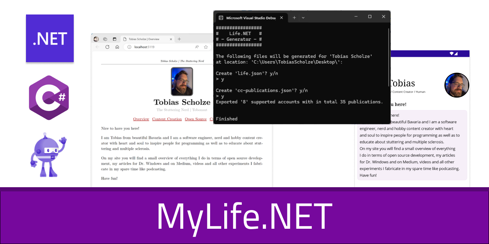
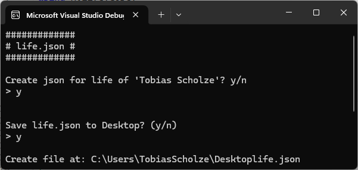
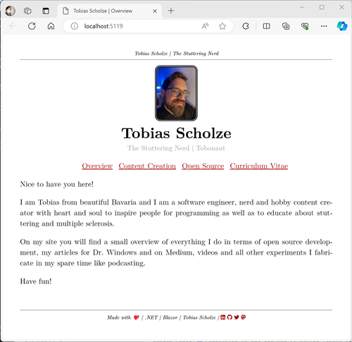

# MyLife.NET
>
> Your life is now a parsable JSON and object structure that can be used in a variaty of use cases. MyLife.NET is an experiment to use as many of .NETs ecosystem features to provi´de an overview of your digital life. The deployed `Blazor.Wasm` can be found that the [related GitHub Page of this repository](https://tscholze.github.io/dotnet-mylife/).

## Build status

| Project              | Action                                                                                                                                                                                                                                  |
| -------------------- | --------------------------------------------------------------------------------------------------------------------------------------------------------------------------------------------------------------------------------------- |
| `MyLife`             | [](https://github.com/tscholze/dotnet-mylife/actions/workflows/dotnet-mylife.yml)                                                       |
| `MyLife.Core`        | [](https://github.com/tscholze/dotnet-mylife/actions/workflows/dotnet-life-core.yml)                                                 |
| `MyLife.Blazor.Wasm` | [](https://github.com/tscholze/dotnet-mylife/actions/workflows/deploy-blazor-wasm.yml) |

## Solution Structure

The solution contains a variaty of projects that are all based on the core context of the app. Creating, exporting and using your life to a vast amount of output possibilities.

| Project                  | Description                                                                    |
| ------------------------ | ------------------------------------------------------------------------------ |
| `MyLife`                 | Console application to create a JSON file                                      |
| `MyLife.Core`            | Provides core functionality as well as the models describing the JSON          |
| `MyLife.Blazor.Wasm`     | Blazor Wasm site that renders a website according to Core's data               |
| `MyLife.Maui`            | **WIP** project to render Core's data as a mobile app                          |
| `MyLife.Azure.Functions` | **Experimental** Evaluating how Functions and how MyLife would benefit from it |
| `MyLife.Blazor.Static`   | **Planned** project to render Core's data as fully static website              |

## How it looks

### MyLife



A simple terminal interface based on just `Console.Write()` and `Console.Read()`.
It can be used in an interactive way to update files on user's desktop and / or the related `wwwroot` folder or in a silent mode via CI runs to update just the `wwwroot/` data.

```bash
cd path-to-code/MyLife/
# Interactive
dotnet run

# Silent
dotnet run silent

# Optional git update
git commit -am "Updated content"
git push
```

### MyLife.Blazor.Wasm

The website is based on a css-drop-in style with minor custom style class added.

**Caution**
The project is still alpha and work in progress.



## Deployments

### MyLife

The CLI tool to create the JSON files are runable through Visual Studio or in the Terminal using:

```shell
cd path-to-repo
cd MyLife
dotnet run
```

### MyLife.Blazor.Wasm

As feature of being a static website, the current demo version of this repository is hosted on GitHub Pages at [tscholze.github.io/dotnet-mylife/](https://tscholze.github.io/dotnet-mylife/) or as an Azure Static Web App using the Free Tier [somewhere in the cloud](https://proud-cliff-0b9376b03.5.azurestaticapps.net/).

```shell
cd path-to-repo
cd MyLife.Blazor.Wasm
dotnet run
```

### MyLife.Azure.Functions

Running the target locally will present you a Terminal window with all available endpoints that are reachable using your Browser. For Azure deployment, please use the Visual Studio or Azure Portal publish feature on your own.

```shell
cd path-to-repo
cd MyLife.Azure.Functions
dotnet run
```

## Motivation

In today's digital age, managing our personal information efficiently has become more important than ever. One interesting approach is to represent our life as a JSON file. This allows us to organize and store various aspects of our life in a structured format, making it easier to manage and analyze.

Having a default but defined datset structure, you can add consumer as you go. This is one part of the project. Having a place to experiment with new .NET technologies with a defined usecase to work with.

## Errors I made

This is an educational project. Errors are made. I maybe misunderstood or misused some technologies. This is all fine because we are all learners and tinkeres. It would be a shame not to share it!

### Blazor WASM cannot connect to foreign servers

Due to web-wide security policies the Blazor WASM project / website cannot connect to foreign servers besides of it self. This is no problem in reading JSON files from itself but it is an issue of you want to read for example a YouTube Channel RSS feed.

If you try this, You will see that the `httpClient.GetAsync()` call never finishes and the error log in the browser shows something like `CORS violation`. To fix this, all the content the site needs must be provides by its own server.

## Publications

- [Dr. Windows: Entwicklertagebuch: MyLife.NET #1 – Wieso, weshalb, warum?](https://www.drwindows.de/news/entwicklertagebuch-mylife-net-1-wieso-weshalb-warum)
- [Dr. Windows: Entwicklertagebuch: MyLife.NET #2 – Der Kern des Ganzen](https://www.drwindows.de/news/entwicklertagebuch-mylife-net-2-der-kern-des-ganzen)
- [Dr. Windows: Entwicklertagebuch: MyLife.NET #3 - Was'n Blazor WASM?](https://www.drwindows.de/news/entwicklertagebuch-mylife-3-wasn-blazor-wasm)
- [Dr. Windows: Entwicklertagebuch: MyLife.NET #4 - Azure wir kommen](https://www.drwindows.de/news/entwicklertagebuch-mylife-4-azure-wir-kommen)
- [Dr. Windows: Entwicklertagebuch: MyLife.NET #5 - Noch mehr function-nierendes Azure](https://www.drwindows.de/news/entwicklertagebuch-mylife-5-noch-mehr-function-nierendes-azure)
- [Dr. Windows: Entwicklertagebuch: MyLife.NET #6 - Das Leben wird mobil dank .NET MAUI](https://www.drwindows.de/news/entwicklertagebuch-mylife-6-das-leben-wird-mobil-dank-net-maui)
- [Dr. Windows: Entwicklertagebuch: MyLife.NET #7 - 2025 wird das .NET MAUI Jahr!](https://www.drwindows.de/news/entwicklertagebuch-mylife-7-2025-wird-das-maui-jahr)

## Branch management

1. `production` is only updated via merges from `main`. No pushes or merges other branches allowed
2. `main` gets its update from feature branches. Direct pushes are allowed but not promoted
3. `feature` gets its update from developer's pushes or back merges from `main` but never from `production`

## Keep in mind

### I'm not an expierenced web and .NET developer

It would be awesome if I could motivate you to try out some of the technologies the solution covers, but please do not take any of the code covering this repository as "the best way to to it".

I'm neither a web developer nor a skilled .NET engineer, yet. There are many awesome folks out there that are more suitable to be used as "learning while copying".

### Not production ready

This app is purely build for educational usage! All features have room for improvements or could be done more elegant. This app was and will be never meant to run in production-like environments. Learning is fun!

## Authors

Just me, [Tobi]([https://tscholze.github.io). You are welcomed to contribute pull requests that are helping me getting more familar with .NET, web development and the topic in general.

## Thanks to

- [Florian](https://de.linkedin.com/in/florianthurnwald) for motivating me to re-evaluate the .NET ecosystem
- [Gerald](https://twitter.com/jfversluis) for providing awesome .NET MAUI content and helping beginners to get started with
- [Jeffrey (csharpfritz)](https://twitter.com/csharpfritz) for his .NET Blazor Twitch streams

## License

This project is licensed under the MIT License - see the [LICENSE](LICENSE) file for details.
Dependencies or assets maybe licensed differently.
