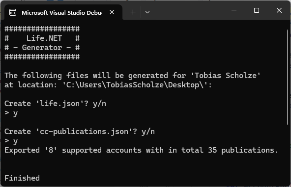

# MyLife.NET
> Your life is now a parsable JSON and object structure that can be used in a variaty of use cases. MyLife.NET is an experiment to use as many of .NETs ecosystem features to provi´de an overview of your digital life.

## Build status
| Project | Action |
|---------|--------|
|`MyLife` ||
|`MyLife.Core`||
|`MyLife.Blazor.Wasm`|-|
## Solution Structure
The solution contains a variaty of projects that are all based on the core context of the app. Creating, exporting and using your life to a vast amount of output possibilities.

| Project | Description |
|----------|----------|
|`MyLife`    | Console application to create a JSON file    |
|`MyLife.Core`    | Provides core functionality as well as the models describing the JSON    |
| `MyLife.Blazor.Wasm`    | **WIP** Blazor Wasm site that renders a website according t Core's data   |
| `MyLife.Maui` | **Planned** project to render Core's data as a mobile app |
| `MyLife.Blazor.Static` | **Planned** project to render Core's data as fully static website |

## How it looks

### MyLife
A simple terminal interface based on just `Console.Write()` and `Console.Read()`.

### MyLife.Blazor.Wasm
The website is based on a css-drop-in style with minor custom style class added.

**Caution**
The project is still alpha and work in progress.

## Motivation

In today's digital age, managing our personal information efficiently has become more important than ever. One interesting approach is to represent our life as a JSON file. This allows us to organize and store various aspects of our life in a structured format, making it easier to manage and analyze.

By having our own life as a JSON file, we can:

1. **Centralize Information**: Instead of scattering our personal data across different platforms and applications, we can store everything in one place. This makes it convenient to access and update our information whenever needed.

2. **Customize and Extend**: With a JSON file, we have the flexibility to define our own data structure and add custom fields as per our requirements. We can include details about our personal goals, achievements, relationships, and much more.

3. **Track Progress**: By regularly updating our JSON file, we can track our progress over time. We can record milestones, accomplishments, and lessons learned, providing a valuable record of our personal growth and development.

4. **Analyze and Visualize**: With the structured nature of JSON, we can easily analyze and visualize our data. We can use data visualization tools or write custom scripts to gain insights into our habits, patterns, and trends, helping us make informed decisions and improvements.

5. **Privacy and Security**: By keeping our personal information in a local JSON file, we have more control over our data privacy and security. We can choose where to store the file and implement appropriate security measures to protect our information.

Having our own life as a JSON file empowers us to take ownership of our personal data and gain a deeper understanding of ourselves. So why not start organizing your life in a structured and meaningful way with MyLife.NET?

## Branch management
1. `production` is only updated via merges from `main`. No pushes or merges other branches allowed
2. `main` gets its update from feature branches. Direct pushes are allowed but not promoted
3. `feature` gets its update from developer's pushes or back merges from `main` but never from `production`

## Keep in mind

### I'm not an expierenced web and .NET developer
It would be awesome if I could motivate you to try out some of the technologies the solution covers, but please do not take any of the code covering this repository as "the best way to to it".

I'm neither a web developer nor a skilled .NET engineer, yet. There are many awesome folks out there that are more suitable to be used as "learning while copying".

### Not production ready
This app is purely build for educational usage! All features have room for improvements or could be done more elegant. This app was and will be never meant to run in production-like environments. Learning is fun!

## Authors
Just me, [Tobi]([https://tscholze.github.io). You are welcomed to contribute pull requests that are helping me getting more familar with .NET, web development and the topic in general.

## Thanks to
- [Florian](https://de.linkedin.com/in/florianthurnwald) for motivating me to re-evaluate the .NET ecosystem
- [Gerald](https://twitter.com/jfversluis) for providing awesome .NET MAUI content and helping beginners to get started with
- [Jeffrey (csharpfritz)](https://twitter.com/csharpfritz) for his .NET Blazor Twitch streams

## License
This project is licensed under the MIT License - see the [LICENSE](LICENSE) file for details.
Dependencies or assets maybe licensed differently.
